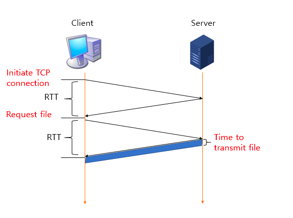
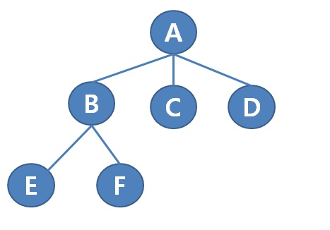
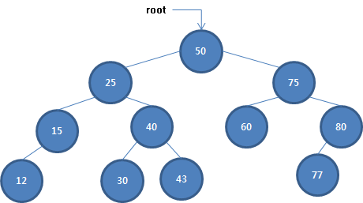
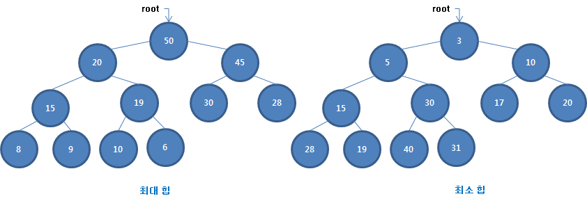

# Data Structure

## 개념

### 1. 추상 데이터 : 데이터를 취급하기 위한 명세
- 특정 데이터 유형에 필요한 연산이 무엇인지 정해둔 명세
- 데이터 변수를 저장하기 위한 인터페이스를 정의해둠으써로, 메모리 속에서 실제로 데이터를 저장하고 연산하는데 필요한 세부사항을 감출 수 있음
- 추상 데이터 유형의 프로시저를 사용하기 때문에 메모리를 직접 조작할 필요 없음
#### 1-1. 기본 데이터 유형
프로그래밍 언어에 내장되어 있어 외부 모듈을 불러오지 않고도 쓸 수 있는 것

#### 1-2. 스택(LIFO)
- push(e) : 요소 e를 스택의 가장 위에 추가
- pop() : 스택의 가장 위의 요소를 가져오고 그 요소를 스택에서 제거

#### 1-3. 큐(FIFO)
- enqueue(e) : 요소 e를 큐의 가장 뒤에 추가
- dequeue() : 큐의 가장 앞 요소를 가져오고 그 요소를 큐에서 제거

#### 1-4. 우선순위 큐
- 큐와 비슷하지만 저장하는 요소의 우선순위 부여 가능
- enqueue(e, p) : 우선순위 수준 p에 따라 요소 e를 큐에 추가
- dequeue() : 큐의 가장 앞쪽 요소를 가져오고 그 요소를 큐에서 제거 

#### 1-5. 리스트
- 유연한 방식으로 데이터를 다루고 싶을때, 아무 위치에서나 요소를 추가, 제거하고 싶을 때 사용
- insert(i, e) : 요소 e를 인덱스 i에 추가
- remove(i) : 인덱스 i 위치의 요소를 제거
- get(i) : 인덱스 i 위치의 요소 조회
- slice(start, end) : start 이상 end 미만 사이 요소로 리스트 분리
- sort() : 리스트 정렬
- reverse() : 리스트 역정렬

#### 1-6. 정렬 리스트
- 리스트의 요소를 추가할 때마다 정렬을 해서 항상 정렬된 상태를 보장
- insert(e) : 요소 e를 올바른 위치에 추가
- remove(i) : 인덱스 i 위치의 요소를 제거
- get(i) : 인덱스 i 위치의 요소 조회

#### 1-7. 맵(딕셔너리)
- key와 value객체로 연관시켜 저장할 때 사용
- set(key, value) : 키-값 쌍을 추가
- delete(key) : key와 key에 연관된 값을 제거
- get(key) : key에 연관된 값을 조회

#### 1-9. 집합
- 요소의 순서가 무의미하고 요소가 중복되지 않아야할 때 사용
- add(e) : 요소 e를 집합에 추가, 이미 존재하는 경우 오류 발생
- list() : 집합의 요소 나열
- delete(e) : 집합에서 요소 e를 제거

### 2. 데이터 구조 : 데이터를 실제로 취급하는 방법
- 추상 데이터 유형은 어떤 데이터 유형에 지원되는 연산이 무엇인지만을 알려 주는 반면 데이터 구조는 컴퓨터의 메모리 속에서 데이터가 실제로 구조화되는 방식과 그 데이터에 접근하는 방식을 알려줌
- 동일한 추상 데이터 유형이라고 하더라도 여러가지 데이터 구조로 표현 되지만, 프로그램을 효율적으로 작성하려면 아무 모듈이나 쓰면 안됨

#### 2-1. 배열
- 배열은 많은 수의 요르소ㄹ 메모리에 저장할 때 사용할 수 있는 방법 중 가장 단순하고 기본적인 방법
- 배열 속에 저장하려는 요소는 그 메모리 공간 속에 순차적으로 기록
- 마지막 요소 뒤에는 특별한 Null 토큰을 기록하여 배열의 끝을 표시
- 배열에 저장된 각 객체는 메모리에서 동일한 용량 차지
- 배열 속 어떤 요소라도 '한번에 접근' 가능
- 스택을 구현하는데 특히 유용하지만, 리스트나 큐도 구현 가능
- **장점** : 프로그램을 이해하기 쉽고, 접근 시간이 상수 시간
- **단점** : 크기가 큰 배열을 사용하려면 연속된 메모리 공간이 많이 필요, 배열 중간의 요소를 추가 제거하는 것이 까다로움(제거하고 모든 요소를 한 칸씩 당기거나 추가하고 밀어야하기 때문)

#### 2-2. 연결 리스트

- 요소를 저장한 칸들을 쇠사슬처럼 연결한 구조
- 배열과 달리 연속적인 메모리 주소로 구성될 필요 없음, 처음부터 필요한 모든 메모리를 할당해 둘 필요도 없음(필요에 따라 할당하면 되기 때문)
- 각 칸은 연결된 다음 칸의 주소를 가리키는 포인터를 가지고 있음
- 포인터가 비어있는 칸이 사슬이 끝나는 지점
- 연결 리스트로 스택, 큐, 리스트를 구현할 수 있음
- **장점** : 실행중 리스트의 크기를 증가시켜도 문제가 되지않음, 언제나 남아있는 메모리 공간만큼 리스트를 만들 수 있음, 요소를 중간에 추가하거나 제거하는 것이 수월
- **단점** : 배열과 달린 n번째 요소를 상수시간에 가져오지 못함, 첫 번째 칸부터 탐색을 시작해서 주소를 따라가야하기 때문, 한칸의 주소만 가지고 요소를 제거하거나 앞으로 옮길 수 없음, 각 칸은 다음 칸의 주소만 가지고 있기 때문

#### 2-3. 이중 연결 리스트
- 연결리스트에서 각 칸이 갖는 포인터를 두개로 늘려 이전 칸과 다음 칸의 주소를 가리키도록 한 것(원형 연결리스트도 가능)
- **장점** : 연결 리스트의 장점을 그대로 계승하며 이전 칸의 포인터르 추가한 덕분에 한칸의 주소만으로도 그 칸을 제거할 수 있음, 이전 칸의 포인터만 바꿔주면 되기 때문
- **단점** : n번 째 요소에 상수 시간에 접근할 수 없다는 단점도 그대로, 포인터가 두개여서 데이터를 저장하는데 필요한 메모리가 더 많음

#### 2-4. 트리

- 트리도 연결리스트와 마찬가지로 메모리 칸을 이용해 정보를 저장
- 트리의 칸도 저장 대상 외에 다른 칸을 향한 포인터를 가짐
- 연결 리스트와 다른 점은 셀과 셀의 포인터가 한줄의 사슬로 연결된 것이 아니라 나무 형태의 구조로 연결되어 있다는 점
- 트리는 파일, 디렉터리 구조나 군 명령계통 등의 계층 데이터에 적합
- 각 칸을 노드, 한 칸에서 다른 칸을 가리키는 포인터를 간선이라고 함
- 루트는 부모 노드를 갖지 않고, 나머지 노드는 하나의 부모 노드를 가짐
- 한 노드에서 루트노드까지의 경로를 깊이(level)라고 함소
- 트리에서 가장 깊은 립(leap) 노드의 깊이가 트리의 높이

#### 2-5. 이진 탐색 트리

- 이진탐색 트리는 효율적인 탐색을 지원하는 특별한 트리로 각 노드가 자식을 최대 두개만 갖질 수 있음
- 노드의 위치는 키값에 의해 결정되고, 부모 노드의 왼쪽 자식 노드는 부모 노드보다 키값이 작아야하고, 오른쪽 자식노드는 커야함
- 이진 탐색 트리에 새 요소를 추가할 때는, 추가하려는 요의 값을 트리에서 탐색해야함
- 탐색 과정에서 마지막으로 방문한 정점을 선택하여 해당 정점의 왼쪽 또는 오른쪽 포인터를 새 정점으로 가리키도록 해야함

#### 2-6. 이진 힙

- 각 노드에서 최대 또는 최소 요소를 즉시 발견할 수 있도록 정렬된 트리
- 우선순위 큐를 구현할 때 이 데이터 구조가 특히 유용
- 힙에서는 최대 또는 최소 요소를 구하는 비용은 O(1)임. 힙의 최대 또는 최소 요소가 항상 트리의 루트이기 때문
- 노드의 탐색 추가 비용은 여전히 O(logN)
- 이진 탐색 트리와 달리 힙에서는 노드들의 순서가 일정하지 않음. 다만, 최대 힙의 경우 부모 노드는 자신의 두 노드 보다 반드시 더 큼
- 요들 사이에 최댓값, 최솟값을 빈번하게 사용한다면 이진 힙을 사용소

#### 2-7. 그래프
- 트리와 비슷하지만 부모, 자식 노드가 없고 루트 노드도 없음
- 그래프에서 데이터는 노드와 간선으로 자유롭게 배열될 수 있음
- 모든 노드는 다른 노드를 가리키는 간선을 여러개 가질 수 있음
- 네트워크 관계, 연결망을 표현하기에 이상적

#### 2-8. 해시 테이블
- 요소의 탐색 비용을 O(1)로 수행할 수 있는 데이터 구조
- 전체 요소 개수가 몇개든 비용이 상수시간으로 동일
- 해시 테이블을 사용하기 위해서는 연속적인 메모리를 미리 할당해야하지만 요소를 순차적으로 저장하는 것은 아님
- 해시 함수는 저장하려는 데이터를 입력받아 의미 없고 불규칙해보이는 수를 출력하고 그 수가 요소를 저장할 위치가 됨
- 해시 테이블에서 어떤 값을 조회할 때, 먼저 그 값을 해시 함수에 입력하면 해시 함수는 메모리 속에 요소가 저장되어 있을 정확한 위치를 출력
- **해시 충돌** : 가끔 해시 함수가 서 로다른 두 입력값에 대해 동일한 메모리 위치를 반환하는 것
- 해시 충돌을 방지하기 위해 해시 테이블의 공간을 최소 50%는 남겨둬야함
- 해시 테이블은 딕셔너리와 집합을 구현하는데 자주 사용
- 요소의 추가, 제거가 트리 기반의 데이터 구조에 비해 빠르지만 올바르게 동작하기 위해 대량의 연속적 메모리 공간이 필요하다는 단점이 있음