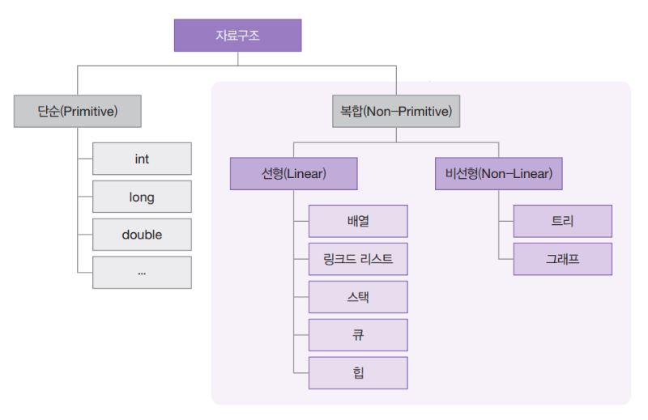
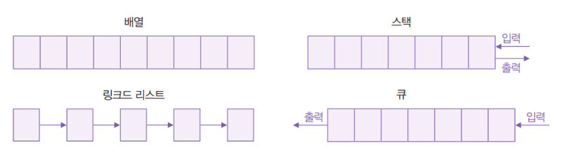
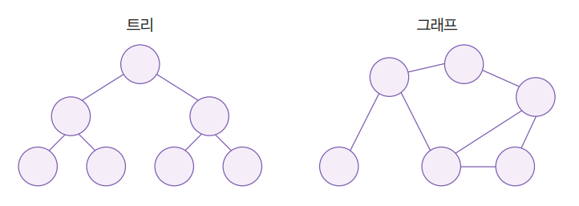
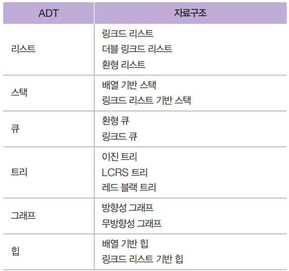

# 0. 들어 가기 전에
## 0-1. 자료구조
자료구조는 컴퓨터가 데이터를 효율적으로 다룰 수 있게 도와주는 데이터 보관 방법과 데이터에 관한 연산의 총체를 말한다. 예를 들어 int도 자료구조이다. int는 32 비트 메모리 공간 안에 수를 할당하되 첫 비트를 부호 표현에 사용하는 등의 '보관 방법'을 정의하고 있고, 덧셈/뺄셈/나눗셈/곱셈/논리/시프트 등의 다양한 '연산'도 정의하고 있다.

자료구조는 단순 자료구조(Primitive Data Structure)와 복합 자료구조(Non-Primitive Data Structure)로 나뉜다. 단순 자료 구조는 int, long, double과 같이 프로그래밍 언어에서 통상적으로 제공하는 기본 데이터 형식이고, 복합 자료 구조는 배열, 리스트, 스택, 큐, 힙, 트리, 그래프 등과 같은 데이터 형식이다.

복합 자료구조는 또다시 선형 자료구조(Linear Data Structure)와 비선형 자료구조(Non-Linear Data Structure)로 나뉜다. 선형 자료구조는 데이터 요소를 순차적으로 연결하는 자료 구조로 구현하기 쉽고 사용하기도 쉽다. 비선형 자료구조는 선형 자료구조와 달리 데이터 요소를 비순차적으로 연결한다. 

### ADT(Abstract Data Types) 
추상 데이터 형식은 자료구조의 동작 방법을 표현하는 데이터 형식이다. 다시 말해 자료구조가 갖춰야할 일련의 연산이라고 할 수 있고 이 연산을 C 언어로 표현하면 함수가 된다. (ADT가 청사진을 제시하고 자료구조가 이를 구현한다고 생각해도 좋다.)

예를 들면, 리스트는 데이터에 순차적으로 접근해서 그 데이터를 다룰 수 있도록 여러 기능을 제공해야 한다. 목록의 특정 위치에 있는 노드에 접근(get)하거나, 목록의 마지막에 데이터를 추가(append)하거나, 목록 중간에 삽입(insert)하거나, 삭제(remove)하는 기능들을 말한다.

## 0-2. 알고리즘
알고리즘은 주어진 문제를 풀기 위한 단게적 절차이다. 즉 알고리즘을 설계한다는 것은 문제 풀이 절차를 설계한다는 것이고, 알고리즘을 구현한다는 것은 프로그래밍 언어를 이용해서 문제 풀이 절차를 실제로 동작하는 코드로 작성한다는 의미이다.

# 1. 자료구조

## 1-1. 리스트

## 1-2. 스택

## 1-3. 큐

## 1-4. 트리

# 2. 알고리즘

## 2-1. 정렬

## 2-2. 탐색

## 2-3. 우선순위 큐와 힙

## 2-4. 해시 테이블

## 2-5. 그래프

## 2-6. 문자열 탐색

# 3. 알고리즘 설계 기법

## 3-1. 알고리즘 성능 분석

## 3-2. 분할 정복

## 3-3. 동적 계획법

## 3-4. 탐욕 알고리즘

## 3-5. 백트래킹
 