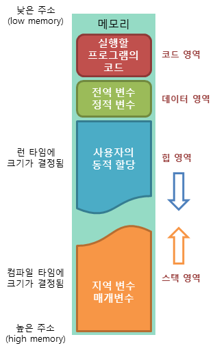
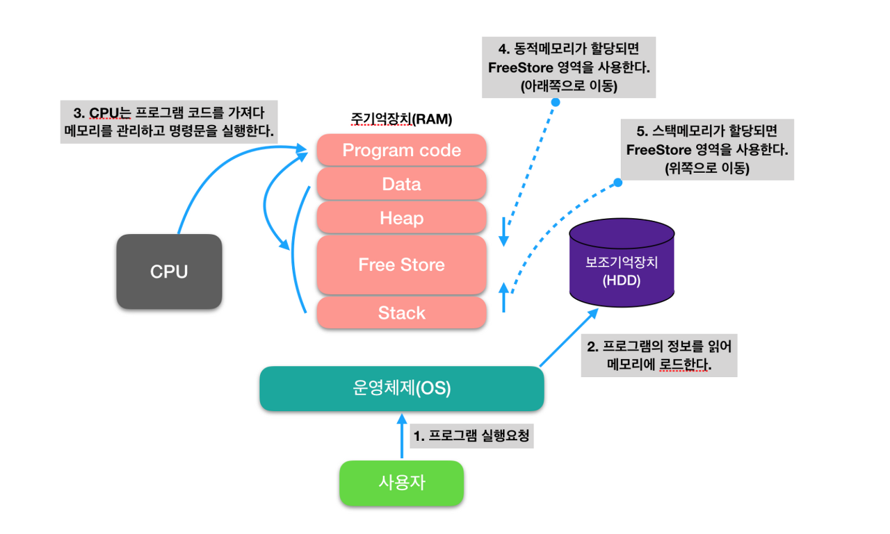

# Programming Language

## 1. 프로그래밍 언어 기초

### 1-1. 프로그래밍 언어의 필요성

컴퓨터는 0과 1로 이루어진 이진 코드로 이루어진 기계어를 사용한다. 따라서 컴퓨터와 사람이 소통하기 위해서는 사람의 언어와 기계어의 다리 역할을 하는 프로그래밍 언어가 필요하다.

### 1-2. 프로그래밍 언어의 종류

#### 고급 언어

컴퓨터와 대화할 수 있도록 만들어진 언어 중 사람이 쉽게 이해할 수 있는 언어이다. 고급 언어로 작성된 파일은 컴퓨터가 바로 이해할 수 없기 때문에 컴파일 과정을 거쳐 기계어로 변환이 필요하다. 대표적인 고급 언어에는 Java, C, C++, C#, Python 등이 있다.

#### 저급 언어

기계어에 가까운 언어, 대표적으로는 어셈블리어가 있다. 어셈블리어는 기계어를 직접 작성하는 것 보다는 사람이 이해하기 쉬운 기호로 작성한 언어로, 특정 컴퓨터 아키텍처에 사용되는 CPU명령어 집합을 가지고 있다. 어셈블리어는 컴퓨터 아키텍처가 다른 컴퓨터 간에는 호환되지 않아 이식성이 낮다.

#### 정적 언어

컴파일 시 변수의 타입이 결정되는 언어이다. 따라서 프로그래머가 변수에 들어갈 값의 형태에 따라 직접 변수의 타입을 명시해줘야 한다. 타입 에러로 인한 문제점을 초기에 발견할 수 있어 타입의 안정성이 높다는 장점이 있지만 매번 코드 작성시 변수형을 결정해줘야하는 번거로움도 있다.

#### 동적 언어

런타임 시 변수의 타입이 결정되는 언어이다. 런타임까지 타입에 대한 결정을 끌고갈 수 있기 때문에 유연성이 높다는 장점이 있지만, 실행 도중에 변수에 예상치 못한 타입이 들어와 타입에러가 발생할 수 있다는 단점도 있다.

### 1-3. 프로그래밍 언어 번역기

번역기는 프로그래밍 언어를 실행가능한 기계어로 변환해주는 프로그램을 뜻한다.

#### 컴파일러

소스코드 전체를 분석한 후 기계어 코드로 변환하는 방식으로 번역을 수행한다. 이때 생성된 기계어 코드는 실행 파일 형태로 저장되어 나중에 필요할 때마다 실행된다.컴파일러를 거치는 언어를 **컴파일 언어**라고하며 대표적으로 C, Java등이 있다.  
컴파일 언어는 한 번만 번역하면 되기 때문에 실행 속도는 빠르지만 소스 코드에 수정이 가해진 경우 다시 컴파일 해야하는 번거로움과 컴파일 시간이 올래 걸리는 경우도 있어서 개발 속도는 느린 편이다.

#### 인터프린터

반면 인터프린터는 소스 코드를 한 줄씩 읽어들여서 바로 실행하는 방식으로 번역을 수행한다. 이때 생성된 기계어 코드는 일시적으로 메모리에 저장되며, 프로그램 실행 중에 필요할 때마다 실행된다. 인터프린터를 거치는 언어를 **스크립트 언어**라고하며 대표적으로 Python, JavaScript등이 있다. 스크립트 언어는 실행할 때마다 번역을 해야해서 실행 속도는 한 번에 번역하는 컴파일 언어보다 느리지만 개발 속도는 컴파일 언어보다 빠르다.

 
 
 

## 2. 변수와 데이터 타입

### 2-1. 변수

컴퓨터 메모리(RAM)는 수많은 번지들로 구성된 데이터 저장 공간이다. 프로그램은 데이터를 메모리에 저장하고 읽는 작업을 빈번히 수행한다. 이때 데이터를 어디에, 어떻게 저장할지 정해져 있지 않다면 메모리 관리가 무척 어려워진다. 프로그래밍 언어는 변수를 사용해 이 문제를 해결한다.

**변수**는 하나의 값을 저장할 수 있는 메모리 번지에 붙여진 이름이다. 변수를 통해 프로그램은 메모리 번지에 값을 저장하고 읽을 수 있다.

#### 변수의 선언

변수를 사용하기 위해서 자바는 먼저 변수를 선언해야한다. 변수 선언은 어떤 타입의 데이터를 저장할 것인지 그리고 변수 이름이 무엇인지를 선언한다. 변수 선언은 저장되는 값의 타입과 이름만 결정한다. 선언만 이루어진 상태에서는 아직 메모리에 할당이 이루어진 것은 아니다.

#### 변수에 대입

변수가 선언되면 대입연산자(=)를 활용 하여 해당 변수에 값을 대입할 수 있다. 그리고 변수에 값이 최초로 대입될 때 메모리에 값이 저장된다.

#### 변수 초기화

변수에 최초로 값을 대입하는 행위를 변수 초기화라고 한다.

#### 변수 타입

변수는 선언될 때 타입에 따라 저장할 수 있는 값의 종류와 허용 범위가 달라진다.  
자바는 정수, 실수, 논리값을 저장할 수 있는 기본 타입 8개를 다음과 같이 제공한다.

| 타입    | 메모리 크기  | 저장되는 값의 허용 범위        |
| ------- | ------------ | ------------------------------ |
| boolean | 1byte(8bit)  | ture, false                    |
| char    | 2byte(16bit) | 유니코드 문자                  |
| byte    | 1byte(8bit)  | -128 ~ 127                     |
| short   | 2byte(16bit) | -32,768 ~ 32,767               |
| int     | 4byte(32bit) | -2,147,483,648 ~ 2,147,483,647 |
| long    | 8byte(64bit) | -2^63 ~ (2^63-1)               |
| float   | 4byte(32bit) | 유효 소수 이하자리 7자리       |
| double  | 8byte(64bit) | 유효 소수 이하자리 15자리      |

### 2-2. 리터럴(Literal)

코드에서 프로그래머가 직접 입력한 값이다.

### 2-3. 기본 타입(Primitive Type)과 참조 타입(Reference Type)

프로그램이에서 사용하는 데이터 타입은 크게 변수의 데이터가 어떻게 저장되고 처리되는지에 따라 2가지 타입으로 나눌 수 있다. 이러한 차이는 변수가 할당된 메모리 영역과 데이터 처리 방식을 결정하는 역할을 한다. 그러나 모든 언어에서 동일한 것은 아니다. 큰 틀은 비슷하지만 각 언어마다 동작하는 방식이 다를 수 있다.

#### 기본 타입(Primitive Type or Value Type)

기본 타입은 대체로 실제 데이터 값을 직접 저장한다. 또한 기본 타입의 변수는 스택 메모리에 저장된다.

대표적인 기본 타입으로는 int, float, fouble, char, boolean 등이 있다.

#### 참조 타입(Reference Type)

참조 타입의 변수는 데이터의 주소를 저장한다. 또한 참조 타입의 변수는 스택 메모리에 저장되지만, 실제 데이터 값은 힙 메모리에 저장된다. 변수는 단지 데이터의 위치를 가리키는 포인터와 같은 역할을 한다. 다시 말해, 실제 데이터 값은 다른 곳에 존재하고 변수는 단지 실제 데이터 값이 존재하는 주소를 저장하고 있을 뿐이다.

대표적인 참조 타입으로는 클래스, 배열, 인터페이스 등이 있다.

#### 심볼 테이블(Symbol Table)

심볼 테이블은 컴파일러 또는 인터프린터의 내부 데이터 구조중 하나로, 프로그램에서 정의된 식별자(변수, 함수, 클래스 등의 이름)와 그에 대한 정보를 관리하는데 사용된다.

심볼 테이블은 구현에 따라 스택(Stact) 영역과 힙(Heap) 영역에 위치될 수 있다. 보통인 컴파일러 및 인터프린
터의 실행 스택에서 관리되고 범위(스포크)에 속하는 식별자의 이름과 정보를 저장한다.

좀 더 복잡한 컴파일러 또는 인터프린터에서는 심볼 테이블을 동적으로 할당된 메모리 영역인 힙(Heap)에 저장할 수 있다. 이것은 실행 중에 동적으로 메모리를 할당하여 실볼 테이블을 유지할 수 있도록 해준다.

이외에도 심볼 테이블을 데이터 섹션 또는 코드 섹션에 저장해서 프로그램의 일부로 저장하기도 한다.

#### 가변 타입(Mutable)

가변 타입은 데이터가 변경 가는한 데이터 타입을 말한다. 이는 데이터를 수정할 수 있다는 것이다. 예를 들어, 배열이나 리스트의 요소를 수정하는 것은 데이터를 수정한 것이다. 그러나 오해하지 말아야할 것은 단일 문자 'A'에서 또 다른 단일 문자 'B'로 데이터를 바꾼 것은 데이터를 수정한 것이 아니라 데이터에 할당된 변수 자체를 바꾸는 것이므로 단일 문자는 가변 타입이 될 수 없다.

대표적인 가변 타입으로는 배열, 리스트, 딕셔너리, 집합 등이 있다.

#### 불가변 타입(Immutable)

불가변 타입은 데이터가 변경이 불가능한 타입을 말한다. 위에서 말한 단일문자 Char를 비롯하여 문자열, 정수, 실수, 튜플 등은 불가변 타입이다. 만일 한 번 생성된 문자열을 수정하려면 새로운 문자열을 생성해야 한다. 또한 불가변 데이터는 복사본을 만들어 수정할 수 있다.

불가변 데이터의 장점은 다중 스레드 환경에서 데이터 무결성을 유지하고 예측 가능한 동작을 보장하는데 도움을 준다는 것이다.

### 2-4. 메모리의 구조

컴퓨터 프로그램이 실행되는 동안 메모리는 여러 영역으로 구분된다. 각 메모리의 영역은 프로그램의 다른 종류의 데이터를 저장하고 관리한다.  

#### 메소드 영역(Method Area or Code Area)

메소드 영역은 주로 클래스의 정의, 클래스 생성자, 정적(static) 변수, 상수 풀, 메서드 코드 등과 관련된 정보를 저장한다. 일반적으로 모든 인스턴스에서 공유되며, 프로그램이 실행될 때 로드되고 초기화 된다.

#### 힙(Heap) 영역

힙 영역은 동적으로 할당된 메모리를 저장하는데 사용된다. 객체, 배열 등의 동적 데이터가 생성되는 영역이다. 생성된 객체의 주소는 메소드 영역과 스택 영역의 상수와 변수에서 참조된다. 또한 상수 또는 변수와의 연결이 끊어지면 GC(Garbage Collector)에 의해 메모리가 릴리즈 된다.

#### 스택(Stack) 영역

스택 영역은 함수의 호출 및 지역 변수를 저장하는데 사용된다. 각 함수의 호출은 스택 프레임으로 표현되며, 스택 프레임에는 지역 변수, 함수 매개변수, 복귀 주소 등이 저장된다. 스택은 함수의 호출과 복귀를 관리한다. 호출 순서에 따라 데이터를 푸쉬(push)하고 팝(pop)하면서 호출 스택(Call Stack)을 관리한다.

 
 
 

## 3. 함수

### 3-1. 함수(Function)와 메소드(Method)

함수와 메소드는 비슷하지만 조금 다르다. 함수는 주로 절차적 프로그래밍 언어나 함수형 프로그래밍 언어에서 사용되고, 메소드는 주로 객체 지향 프로그래밍 언어에서 사용된다.

#### 함수(Function)

함수는 독립적으로 존재할 수 있고, 전역 함수로 정의되면 어디서나 호출할 수 있다. 그러나 함수는 주로 입력에 따라 결과를 반환할 뿐 내부 상태를 유지하지 않는 경우가 대부분이다.

#### 메소드(Method)

메소는 클래스 내부에 정의되어 해당 클래스의 인스턴스 또는 객체를 통해서만 호출된다. 따라서 독립적으로 존재할 수 없다.

#### 프로시저(Procedure)

프로그래밍에서 사용되는 일련의 명령어 블록 또는 코드 조각을 말한다. 프로시저는 함수와 비슷하지만 일반적으로 반환 값을 갖지 않는다는 점이 다르다. 경우에 따라서는 프로시저와 함수를 구분하지 않기도 한다.

#### 모듈(Module)

모듈은 개별 코드 단위로 1개 이상의 함수를 정리하여 특정 기능(함수, 변수, 클래스 등)을 담고 있는 것이다.

#### 패키지(Package)

패키지는 관련된 모듈의 집합이다. 일반적으로 디렉터리 구조로 표현된다. 패키지는 네임스페이스를 관리하고 관련 모듈을 구조화하는데 사용된다.

#### 라이브러리(Library)

라이브러리는 여러 모듈, 패키지, 함수의 집합이다. 일반적으로 공통된 작업을 수행하는데 필요한 코드와 도구를 제공한다.

### 3-2. 인자(Arguemnt)와 매개변수(Parammeter)

#### 매개변수(Parammeter)

매개 변수는 함수 또는 메소드 정의에서 사용되는 변수 이름이다. 함수를 정의할 때 인자로 들어올 데이터를 받는 변수이다.

#### 인자(=인수,Arguemnt)

인자는 함수 또는 메소드를 호출할 때 전달되는 실제 값이다. 함수 호출 시 매개 변수에 전달된다.

### 3-3. 함수의 인자 전달 방식

#### Call by Value(복사 값 호출)

함수 호출 시, 해당 함수에 전달되는 인자의 복사본이 전달되는 방식이다. 함수 내에서 매개 변수는 인자의 복사본을 가지며, 복사본인 매개 변수에 대한 변경은 원래 값인 인자에 영향을 미치지 않는다.

#### Call by Reference(주소 호출)

함수 호출 시, 해당 함수에 전달된 인자의 주소를 전달하는 방식이다. 함수 내에서 매개 변수는 인자와 주소를 공유하며, 매개 변수에 대한 변경은 원래 값인 인자에 영향을 미친다.

## 4. 프로그램 실행 순서

